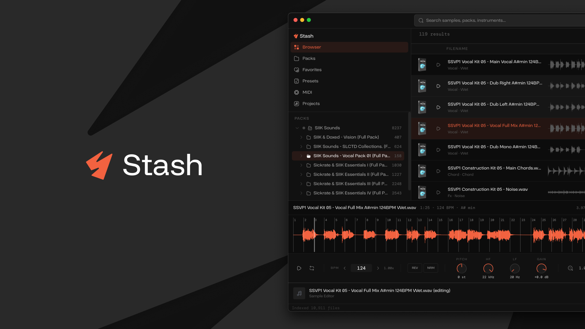
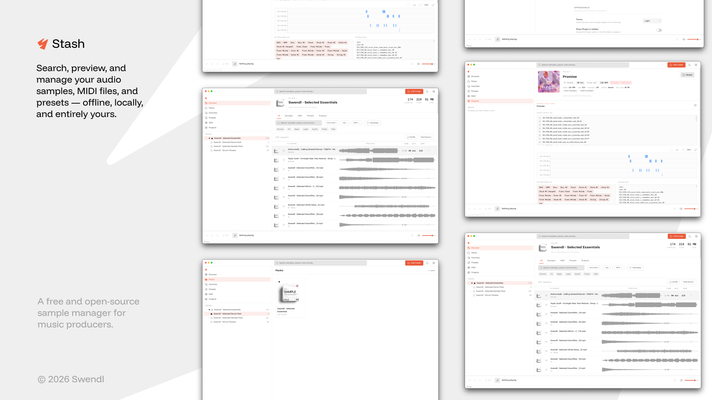

# Stack




Local sample library manager for producers. Splice-inspired interface, fully offline.
Browse, filter by BPM/key, preview audio and MIDI, and organize your own library.

**Download:** [stack.swendl.com](https://stack.swendl.com)

## Features

- Offline-first desktop app
- Fast indexing for samples, MIDI, and presets
- BPM/key filtering and full-text search
- Audio waveform and MIDI preview
- Folder-based browser with pack organization
- Auto-update flow via GitHub Releases

## Tech Stack

- **Desktop:** Tauri 2.0
- **Frontend:** React 18 + TypeScript + Vite
- **Backend:** Rust
- **Database:** SQLite



## Prerequisites

- Node.js 20+
- npm
- Rust 1.78+ (stable), install via [rustup](https://rustup.rs)
- macOS: Xcode Command Line Tools (`xcode-select --install`)

## Local Development

```bash
npm install
npm run tauri dev
```

## Production Build

```bash
npm run tauri build
```

The app stores SQLite in the platform-standard app data directory:

- macOS: `~/Library/Application Support/app.stack.desktop/stack.db`
- Linux: `~/.local/share/app.stack.desktop/stack.db`
- Windows: `%APPDATA%\\app.stack.desktop\\stack.db`

## Release

Push a version tag to trigger the release workflow:

```bash
git tag v1.0.0
git push origin v1.0.0
```

## Project Structure

```text
src/              React + TypeScript frontend
src-tauri/src/    Rust backend (commands, core, db, metadata, models)
```

## First Run

1. Launch the app.
2. Click **Add Folder** in the sidebar.
3. Select a folder containing samples, MIDI, or presets.
4. Wait for indexing to complete.
5. Search, filter, and preview assets in the Browser tab.

## License

MIT. See [LICENSE](LICENSE).
